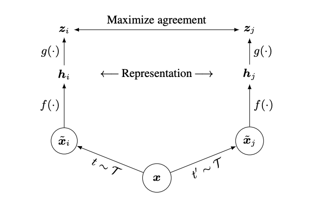
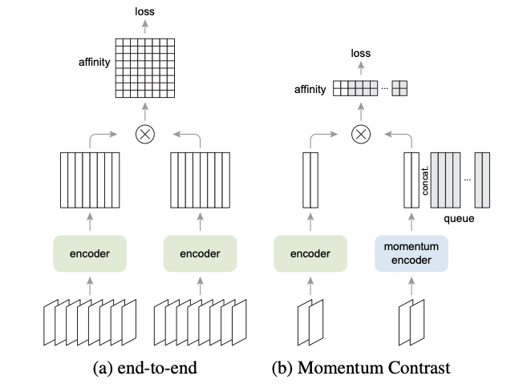
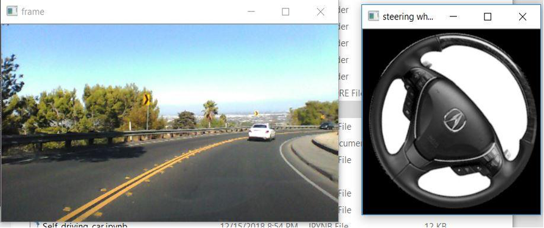

# Portfolio
---
## Natural Language Processing

**Named Entity Recognition of ebay Listings:** Implemented Named Entity Recognition of eBay’s listings as part of its Machine Learning competition. Computed and contrasted models built using Bi-directional LSTM, BERT to tag Brand, product type, model etc. Evaluated performance of both the models and BERT achieved an F1 score of 86%.
([GitHub](https://github.com/RashmikaReddy/Named-Entity-Recognition)).

**Quora Question similarity:** Converted the quora questions into a vector using TF-IDF, word2vec, on which classification algorithms, Logistic Regression, and Support vector machine are applied, achieving 50% less log-loss over baseline model Random Forest.
 ([GitHub](https://github.com/RashmikaReddy/Quora-Question-Similarity)).

 **Network Pruning and Quantization for LLMs:** : By conducting a comparative analysis of network pruning and LLM-int8 quantization techniques on a pre-trained RoBERTa Language Model for sentiment analysis, we achieved a significant reduction in inference time of at least 4x for both techniques. These findings demonstrate the potential of network pruning and quantization techniques for optimizing the deployment of Language Models in resource-constrained environments, without compromising the model's accuracy in sentiment analysis.

---
### Detect Non-negative Airline Tweets: BERT for Sentiment Analysis

The release of Google's BERT is described as the beginning of a new era in NLP. In this notebook I'll use the HuggingFace's transformers library to fine-tune pretrained BERT model for a classification task. Then I will compare BERT's performance with a baseline model, in which I use a TF-IDF vectorizer and a Naive Bayes classifier. The transformers library helps us quickly and efficiently fine-tune the state-of-the-art BERT model and yield an accuracy rate 10% higher than the baseline model.

---
### Detect Food Trends from Facebook Posts: Co-occurence Matrix, Lift and PPMI

First I build co-occurence matrices of ingredients from Facebook posts from 2011 to 2015. Then, to identify interesting and rare ingredient combinations that occur more than by chance, I calculate Lift and PPMI metrics. Lastly, I plot time-series data of identified trends to validate my findings. Interesting food trends have emerged from this analysis.

 

 

---
### Detect Spam Messages: TF-IDF and Naive Bayes Classifier

In order to predict whether a message is spam, first I vectorized text messages into a format that machine learning algorithms can understand using Bag-of-Word and TF-IDF. Then I trained a machine learning model to learn to discriminate between normal and spam messages. Finally, with the trained model, I classified unlabel messages into normal or spam.

 

 

---
## Deep Learning 

### SimCLR paper implementation

Successfully replicated the outcomes of the SimCLR and MoCo-V2 self-supervised algorithms on Fast.AI datasets for image classification, as presented in the corresponding research papers.
.

 

 

---
### MoCo-V2 paper Implementation

 Successfully replicated the outcomes of the SimCLR and MoCo-V2 self-supervised algorithms on Fast.AI datasets for image classification, as presented in the corresponding research papers.

 

 

---

### Steering angle detection in Self driving cars

Implemented a Convolutional Neural Network (CNN) for detecting steering angles, using input images and corresponding steering angles as output, with the aim of improving autonomous driving systems.

 

 

## Data Science 

### Predict Breast Cancer with RF, PCA and SVM using Python

Conducted an experimental study using statistical tests and logistic regression techniques to analyze the correlation between social media usage and mental health problems.
.

 

 

---